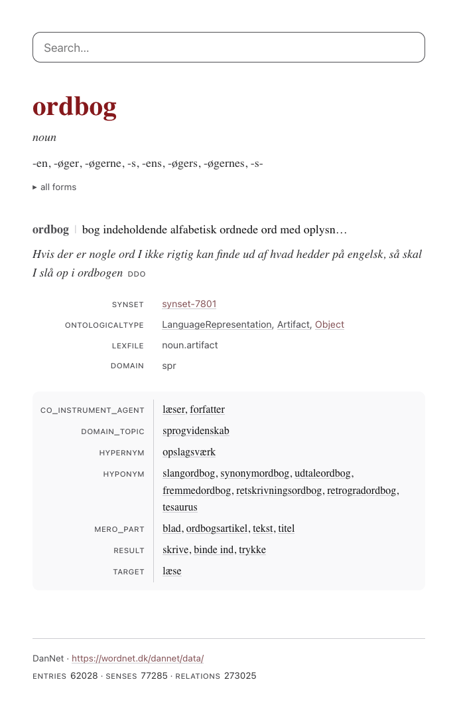

# dmlex-viewer



A generic viewer for [DMLex 1.0](https://docs.oasis-open.org/lexidma/dmlex/v1.0/os/dmlex-v1.0-os.html)
lexicographic resources. The viewer shows a DMLex file as a dictionary. It
has one search field, hyperlink navigation, and a typography-first entry
display in black, white and grey.

The viewer is a static site with no server and no database. A build step
shards the single-file DMLex JSON serialization into small data files. The
browser fetches only the entry that it shows.

The project began as a side project of DanNet. It works on any DMLex 1.0
JSON file and holds no DanNet knowledge. The frontend uses ClojureScript
and [Replicant](https://github.com/cjohansen/replicant), without React.

## Build the data

1. Copy your DMLex JSON file into `datasets/`.
2. Run the build:

```sh
clj -J-Xmx8g -M:build datasets/your-dmlex.json
```

The build writes three kinds of file into `public/data/`:

- `manifest.json` holds the resource metadata.
- `index.json` holds the search index, sorted with the collation of the
  resource language.
- `entries/<id>.json` holds one pre-resolved file for each entry.

The build resolves the display data before the frontend runs. Labels carry
the description and the `sameAs` URI of their `labelTag`. Inflected forms
carry the description of their `inflectedFormTag` and a computed affix, for
example `-t` for the form *mennesket*. Each relation attaches to its member
entries and senses as display rows. Rows with the same relation type, seen
from the same side, merge into one row.

## Build the frontend

1. Install the npm dependencies: `npm install`
2. Compile the release build: `npx shadow-cljs release app`

For development, use `npx shadow-cljs watch app`. The watch compiles on
each change and serves `public/` at <http://localhost:8000>.

## Serve

Point a static file server at `public/`:

```sh
python3 -m http.server 8000 -d public
```

## Deploy

The `public/` directory is a complete static site. Any static host can
serve it.

For a production host:

1. Serve every file over HTTPS. Redirect plain HTTP to HTTPS.
2. Compress text responses with brotli or gzip.
3. Set these response headers:

| Header | Value |
|---|---|
| `Strict-Transport-Security` | `max-age=31536000; includeSubDomains` |
| `X-Content-Type-Options` | `nosniff` |
| `Content-Security-Policy` | `default-src 'self'` |
| `Referrer-Policy` | `strict-origin-when-cross-origin` |
| `Cache-Control` | `no-cache` for `index.html`, `js/main.js` and `data/` |

The viewer loads no third-party resources, so the strict policy is safe.
The file names do not change between builds, so `no-cache` makes the
browser revalidate each file.

Some files stay out of the repository until the site has a stable public
URL: a custom 404 page, the Open Graph tags, a `rel="canonical"` link,
and an `llms.txt` for AI agents. The audit record against
[The Website Specification](https://specification.website/) is in
[doc/website-spec.md](doc/website-spec.md).

## TODO

- Add an optional presentation configuration for each dataset: a small
  JSON file next to the data. The configuration can hide, rename, and
  reorder label types. The mechanism stays generic, and the taste stays
  dataset-specific. The viewer never learns what a label type means.
