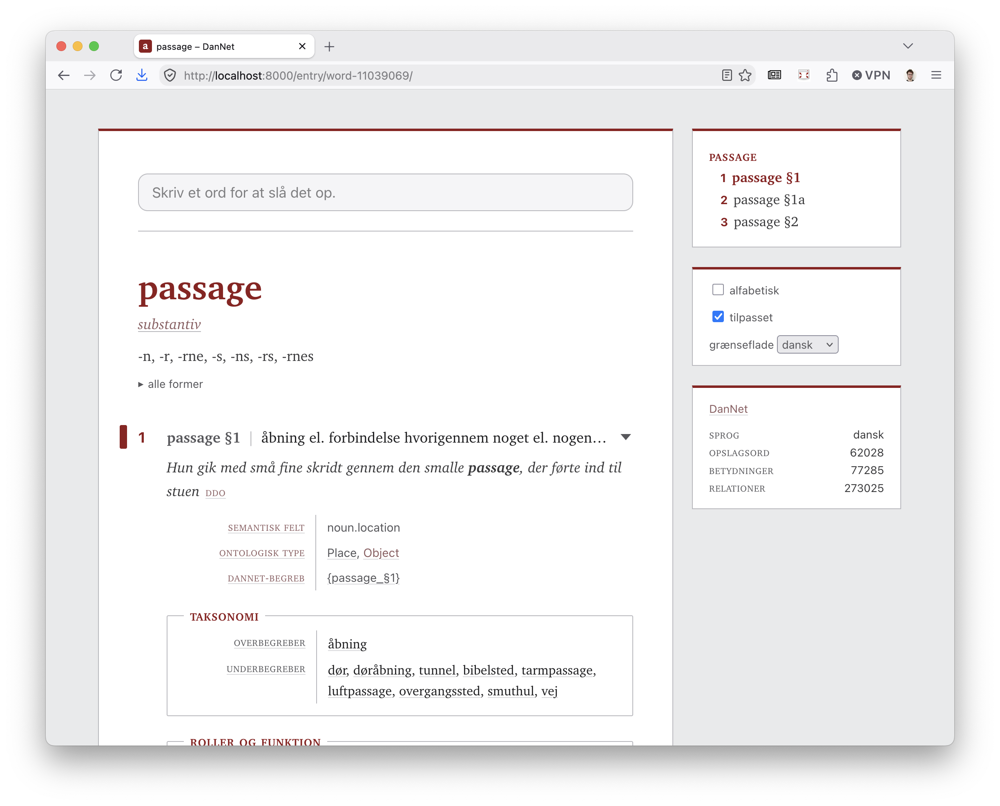

# DMLex browser



A generic browser for [DMLex 1.0](https://docs.oasis-open.org/lexidma/dmlex/v1.0/os/dmlex-v1.0-os.html)
lexicographic resources. The app shows a DMLex file as a dictionary.
It has one search field, hyperlink navigation, and a typography-first
entry display in black, white and grey.

The app is a static site with no server and no database. A build step
shards the single-file DMLex JSON serialization into small data files
and pre-renders one page per entry. Every page reads without
JavaScript. The app then takes it over, and the browser fetches only
the entry that it shows.

The project began as a side project of DanNet. It works on any DMLex 1.0
JSON file and holds no DanNet knowledge. The frontend uses ClojureScript
and [Replicant](https://github.com/cjohansen/replicant), without React.

A first run is three sections in this order: build the data, build the
frontend, and serve.

## Build the data

1. Copy your DMLex JSON file, or a zip export that contains it, into
   `datasets/`.
2. Run the build:

```sh
clojure -J-Xmx8g -M:build datasets/your-dmlex.json
```

The build finds the DMLex JSON inside a zip and reads the companion
files from the same place. A downloaded export like `dannet-dmlex.zip`
needs no unpacking.

The build writes three kinds of data file into `public/data/`:

- `manifest.json` holds the resource metadata. A Dublin Core
  `metadata.json` next to the DMLex file merges in. The app shows
  the description, rights, license and sources on the front page.
- `index.json` holds the search index, sorted with the collation of the
  resource language.
- `entries/<id>.json` holds one pre-resolved file for each entry.

It also writes the pages of the site next to the data, through the same
views that the browser renders:

- `public/index.html` is the front page, titled with the resource and
  carrying its front matter.
- `public/entry/<id>/index.html` is the page of one homograph group.
  Its URL is the one the app navigates to, so a reader without
  JavaScript, and a crawler, see the entry that a reader with
  JavaScript sees.

Both are generated, so neither is in the repository. Build the data
before serving the site.

The build clears `public/data/entries/` and `public/entry/` before it
writes them, so no stale entry survives a rename. It is also much
faster than rewriting them in place: on a copy-on-write filesystem,
overwriting a file costs several times what creating one does, which
for DanNet is the difference between two minutes and eleven.

The build resolves the display data before the frontend runs:

- Labels, label types, parts of speech, relation types, and example
  sources carry the description and the `sameAs` URI of their
  inventory tag. The app shows the URI as a link.
- Inflected forms carry the description of their `inflectedFormTag`
  and a computed affix, for example `-t` for the form *mennesket*.
- Definition and example texts carry their stand-off
  `headwordMarkers` and `collocateMarkers` as display runs. The
  app shows the marked headword in bold and a collocate with its
  lemma as the tooltip.
- The labels of an example follow it in parentheses. The
  `headwordTranslations` of a sense form one line of equivalents,
  grouped by language.
- Each relation attaches to its member entries and senses as display
  rows. Rows with the same relation type and the same direction merge
  into one row. The tooltip of a row prefers the description of its
  relation instance, then of its role's memberType, then of its
  relation type. A member whose memberType hints `"none"` stays out.
- Entries that share a headword and a part of speech carry the files
  of the whole group as `homographs`. The web app merges the group
  into one page and offers one search suggestion for it.

## Describe the data

A Dublin Core `metadata.json` next to the DMLex file describes the
resource: the title, the description, the rights, the license and
the sources. Every field is optional, and so is the file itself.
[doc/metadata.md](doc/metadata.md) lists the fields.

## Present the data

A dataset can ship a small `presentation.json` file next to its
DMLex JSON. The file can hide, rename, reorder and group what the
app shows, and it can translate the interface of the app. The keys
are the dataset's own tags, so the app never has to know what a tag
means. [doc/presentation.md](doc/presentation.md) describes every
section of the file.

## Build the frontend

1. Install the npm dependencies: `npm install`
2. Compile the release build: `npx shadow-cljs release app`

## Serve

Point a static file server at `public/`:

```sh
python3 -m http.server 8000 -d public
```

The host has to serve `index.html` for a directory URL, which every
static host does. Nothing else is needed: entry URLs are real files.

## Deploy

The `public/` directory is a complete static site. Any static host can
serve it.

For a production host:

1. Serve every file over HTTPS. Redirect plain HTTP to HTTPS.
2. Compress text responses with brotli or gzip.
3. Set these response headers:

| Header | Value |
|---|---|
| `Strict-Transport-Security` | `max-age=31536000; includeSubDomains` |
| `X-Content-Type-Options` | `nosniff` |
| `Content-Security-Policy` | `default-src 'self'` |
| `Referrer-Policy` | `strict-origin-when-cross-origin` |
| `Cache-Control` | `no-cache` for `index.html`, `entry/`, `js/main.js` and `data/` |

The app loads no third-party resources, so the strict policy is safe.
The file names do not change between builds, so `no-cache` makes the
browser revalidate each file.

Some files stay out of the repository until the site has a stable public
URL: a custom 404 page, the Open Graph tags, a `rel="canonical"` link,
a `sitemap.xml`, and an `llms.txt` for AI agents. The reasons are in
[doc/design.md](doc/design.md), with the record of the audit against
[The Website Specification](https://specification.website/).

## Build an Apple dictionary


The same DMLex file can become a dictionary for the macOS Dictionary
app. Run the export from the project root:

```sh
clojure -J-Xmx8g -M:appledict datasets/your-dmlex.json
```

The export writes an Apple Dictionary source project into
`export/appledict/`: the dictionary XML, the stylesheet, an Info.plist
and a Makefile. The entries show the same content as the web app.
The entry shows the short inflected forms, and the search index holds
the full forms. If a Dublin Core `metadata.json` sits next to the DMLex
file, its fields fill the bundle metadata and the front matter. A zip
export works here too, exactly as in the data build.

To build and install the `.dictionary` bundle, you need the Dictionary
Development Kit from Apple's "Additional Tools for Xcode". Then:

```sh
cd export/appledict && make && make install
```

The export command takes two optional arguments: the output directory
and the path of the Dictionary Development Kit. The Makefile points at
`/Library/Developer/Extras/Dictionary Development Kit` by default, and
each export writes a new Makefile. If your kit is elsewhere, give its
path on each export:

```sh
clojure -J-Xmx8g -M:appledict datasets/your-dmlex.json export/appledict "$HOME/Developer/Dictionary Development Kit"
```

## Develop and test

[doc/development.md](doc/development.md) describes the development
watch, the scene workbench, the tests and the translation workflow.
