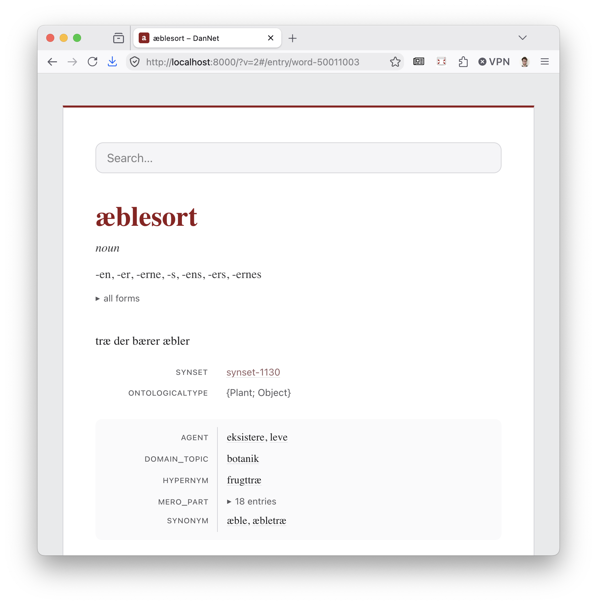
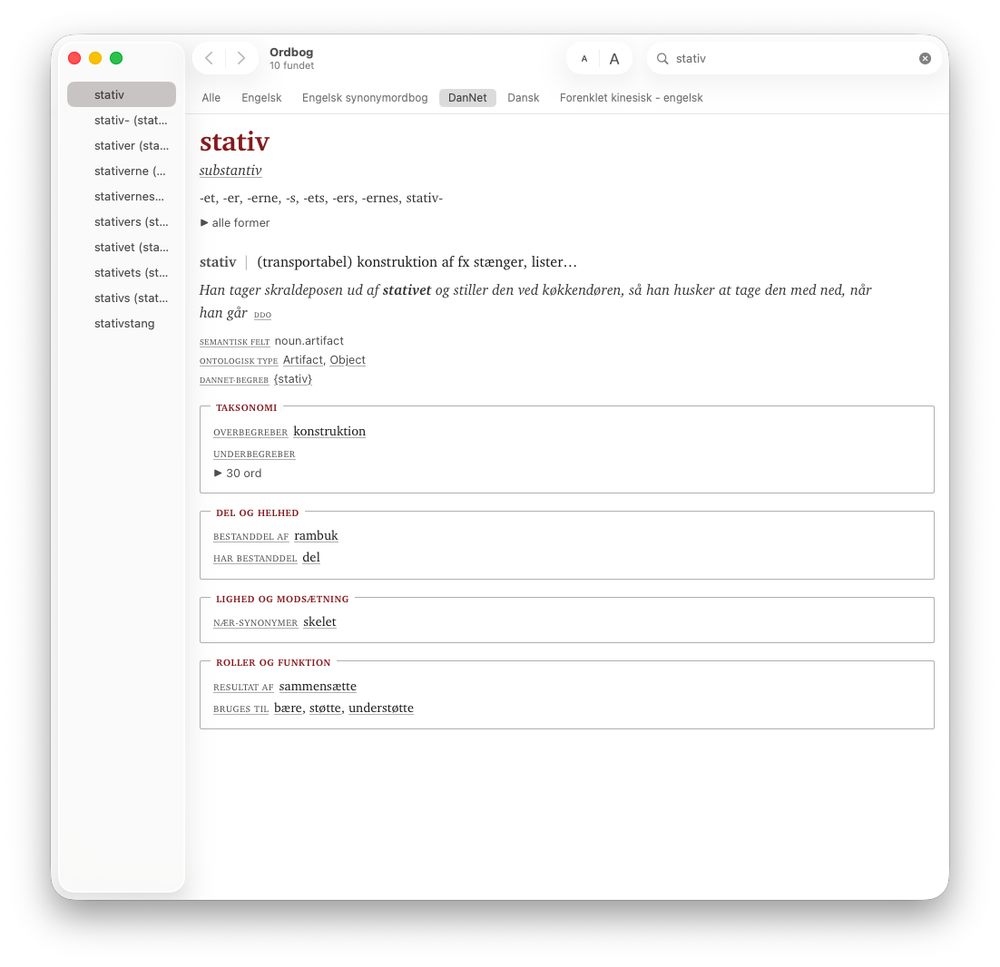

# dmlex-viewer



A generic viewer for [DMLex 1.0](https://docs.oasis-open.org/lexidma/dmlex/v1.0/os/dmlex-v1.0-os.html)
lexicographic resources. The viewer shows a DMLex file as a dictionary.
It has one search field, hyperlink navigation, and a typography-first
entry display in black, white and grey.

The viewer is a static site with no server and no database. A build step
shards the single-file DMLex JSON serialization into small data files.
The browser fetches only the entry that it shows.

The project began as a side project of DanNet. It works on any DMLex 1.0
JSON file and holds no DanNet knowledge. The frontend uses ClojureScript
and [Replicant](https://github.com/cjohansen/replicant), without React.

A first run is three sections in this order: build the data, build the
frontend, and serve.

## Build the data

1. Copy your DMLex JSON file, or a zip export that contains it, into
   `datasets/`.
2. Run the build:

```sh
clojure -J-Xmx8g -M:build datasets/your-dmlex.json
```

The build finds the DMLex JSON inside a zip and reads the companion
files from the same place. A downloaded export like `dannet-dmlex.zip`
needs no unpacking.

The build writes three kinds of file into `public/data/`:

- `manifest.json` holds the resource metadata. A Dublin Core
  `metadata.json` next to the DMLex file merges in. The viewer shows
  the description, rights, license and sources on the front page.
- `index.json` holds the search index, sorted with the collation of the
  resource language.
- `entries/<id>.json` holds one pre-resolved file for each entry.

The build resolves the display data before the frontend runs:

- Labels, label types, parts of speech, relation types, and example
  sources carry the description and the `sameAs` URI of their
  inventory tag. The viewer shows the URI as a link.
- Inflected forms carry the description of their `inflectedFormTag`
  and a computed affix, for example `-t` for the form *mennesket*.
- Definition and example texts carry their stand-off
  `headwordMarkers` and `collocateMarkers` as display runs. The
  viewer shows the marked headword in bold and a collocate with its
  lemma as the tooltip.
- The labels of an example follow it in parentheses. The
  `headwordTranslations` of a sense form one line of equivalents,
  grouped by language.
- Each relation attaches to its member entries and senses as display
  rows. Rows with the same relation type and the same direction merge
  into one row. The tooltip of a row prefers the description of its
  relation instance, then of its role's memberType, then of its
  relation type. A member whose memberType hints `"none"` stays out.

## Describe the data

A Dublin Core `metadata.json` next to the DMLex file describes the
resource. The data build merges it into `manifest.json` for the front
page. The Apple dictionary export fills the bundle metadata and the
front matter from the same file. Every field is optional, and so is
the file itself. Without it, the title, URI and language come from the
DMLex file.

| Field | Meaning |
|---|---|
| `dc:title` | The resource title. It replaces the DMLex `title`. |
| `dc:identifier` | The resource URI. It replaces the DMLex `uri`. |
| `dc:language` | The resource language. It replaces the DMLex `langCode`. |
| `dc:description` | A description for the front page: a string, or a map of language codes to strings. The build reads the resource language and falls back to English. |
| `dc:publisher` | The publishing institution. |
| `dc:rights` | A rights statement. |
| `dc:license` | The license URL. The viewer shows a Creative Commons URL as its short name, for example CC BY-SA 4.0. |
| `dc:issued` | The version of the Apple dictionary bundle. |
| `dc:source` | The source works, as a list of maps. Each map has an optional `dc:title`, `dc:identifier` (the home URI) and `dc:license`. A title like `DDO (Den Danske Ordbog)` splits into the abbreviation and the full name. |

## Present the data

A dataset can ship its taste as a small `presentation.json` file next
to its DMLex JSON. The file can hide, rename, reorder and group the
label types and the relation types, and it can rename the relation
roles. The keys are the dataset's own tags. The viewer applies the
operations and never has to know what a tag means. Without the file,
the viewer shows the dataset's own names and order. It ignores unknown
sections and unknown tags. The data build carries the file into
`public/data/`, and the Apple dictionary export reads it next to its
input file. On an entry page, the web viewer has a checkbox that
turns the config off, to show the neutral default view. The browser
remembers the choice per dataset.

```jsonc
{
  "labelTypes": {
    "order":    ["domain", "register"],
    "hide":     ["spelling"],
    "unlisted": "hide",              // or "after" (the default)
    "rename":   {"domain": "emne"},
    "combine":  {"sentiment": "sentimentValue"},
    "show":     {"synset": "description"}
  },
  "relationTypes": {
    "order":  ["synonym"],
    "groups": [{"title": "Betydning", "types": ["synonym", "antonym"]},
               {"title": "Andre relationer"}]
  },
  "roles":         {"rename": {"hypernym": "overbegreb"}},
  "memberOrder":   "collation",      // or "listing" (the default)
  "linkResolver":  "https://wordnet.dk/dannet/external?subject=",
  "css":           "extra.css",

  // Translations of the viewer chrome into the dataset's language.
  "ui": {
    "all forms":   "alle former",
    "{n} entries": "{n} ord"
  },

  // Only the Apple dictionary export reads this section.
  "appledict": {
    "identifier":  "org.example.dictionary",
    "css":         "appledict-extra.css",
    "frontMatter": "front-matter.html"
  }
}
```

The design decisions behind the config are in
[doc/design.md](doc/design.md).

### `labelTypes` and `relationTypes`

Both sections take the same four operations over their tags:

- `order` lists the tags that come first, in this order. The other
  tags keep the dataset's order after them.
- `unlisted` applies to the tags that are not in `order`. The value
  `"after"` (the default) keeps them, and `"hide"` removes them.
- `hide` lists the tags that never show. A hidden tag stays hidden
  through every other operation.
- `rename` maps a tag to its displayed name. Only the displayed name
  changes. The tag stays the key everywhere else.

Label types take two more:

- `combine` maps a host type to a qualifier type. The values of the
  qualifier show on the host label as "value (qualifier)", and the
  labels of the qualifier disappear. A qualifier without a host stays
  an ordinary label. Nothing disappears by accident.
- `show` maps a type to `"description"`: the labels of that type show
  their description, and the technical tag moves into the tooltip.
  A label without a description keeps its tag.

Relation types take one more:

- `groups` gathers the relation rows into titled sections. Each group
  has an optional `title` and `description`, and a `types` vector
  that claims its rows, in that order. A group without `types` is the
  fallback for every unclaimed row. If no group is the fallback and
  `unlisted` is not `"hide"`, the unclaimed rows form a trailing
  group without a title. Empty groups disappear.

### `roles`

`rename` maps a relation role to its displayed name, the same way as
a tag rename.

### `memberOrder`

With `"listing"` (the default) the members of a relation row keep the
listing order of the dataset. `"collation"` sorts them by the
`obverseListingOrder` of each member first, then by the headword in
the collation of the resource language. A member without an order
sorts after every member with one. The web viewer always has a
checkbox that switches between the two orders, and `memberOrder` sets
its initial state. The browser remembers the choice per dataset. The
Apple dictionary has no checkbox, so there the setting decides alone. DanNet, for example, derives the member order
from how many relations point at each synset. With `"collation"` the
most central words then come first.

### `linkResolver`

A URL prefix that reroutes every `sameAs` link through the dataset's
own resource browser (vocabulary URIs usually serve raw RDF files,
which help no reader). The link becomes the prefix plus the
percent-encoded URI. Links already on the resolver's host stay
direct.

### `css`

The name of a stylesheet next to the DMLex file. The data build
copies it into `public/data/`. The Apple dictionary export bundles it
before the `appledict` stylesheet.

### `ui`

The viewer's own interface strings are English. The `ui` section
translates them in the gettext style: the English string is its own
key, `{n}` carries a count, and singular and plural are separate keys
(`"1 match shown"`, `"{n} matches shown"`). An untranslated string
stays English and keeps its `lang="en"` marker for assistive
technology. The viewer treats a translated string as text in the
language of the resource. The Apple dictionary export applies the
same table at export time. This also covers the strings that its
stylesheet shows as CSS content.

The viewer bundles a Danish translation ([i18n/da.po](i18n/da.po))
and picks it by the `langCode` of the resource. The web viewer also
has a dropdown that switches the UI language. The browser remembers
the choice per dataset. A dataset can override or extend the bundled
table with its own `ui` section. It can also ship the translations as
a gettext `ui.po` next to its DMLex file (the format that translation
tools like Poedit produce). The builds merge the po file over the
`ui` section.

### `appledict`

Only the Apple dictionary export reads this section. `identifier`
replaces the bundle identifier. `css` names a stylesheet that the
export bundles after the shared one. `frontMatter` names an HTML
fragment that becomes the front matter of the dictionary.

## Build the frontend

1. Install the npm dependencies: `npm install`
2. Compile the release build: `npx shadow-cljs release app`

## Serve

Point a static file server at `public/`:

```sh
python3 -m http.server 8000 -d public
```

## Deploy

The `public/` directory is a complete static site. Any static host can
serve it.

For a production host:

1. Serve every file over HTTPS. Redirect plain HTTP to HTTPS.
2. Compress text responses with brotli or gzip.
3. Set these response headers:

| Header | Value |
|---|---|
| `Strict-Transport-Security` | `max-age=31536000; includeSubDomains` |
| `X-Content-Type-Options` | `nosniff` |
| `Content-Security-Policy` | `default-src 'self'` |
| `Referrer-Policy` | `strict-origin-when-cross-origin` |
| `Cache-Control` | `no-cache` for `index.html`, `js/main.js` and `data/` |

The viewer loads no third-party resources, so the strict policy is safe.
The file names do not change between builds, so `no-cache` makes the
browser revalidate each file.

Some files stay out of the repository until the site has a stable public
URL: a custom 404 page, the Open Graph tags, a `rel="canonical"` link,
and an `llms.txt` for AI agents. The reasons are in
[doc/design.md](doc/design.md), with the record of the audit against
[The Website Specification](https://specification.website/).

## Build an Apple dictionary



The same DMLex file can become a dictionary for the macOS Dictionary
app. Run the export from the project root:

```sh
clojure -J-Xmx8g -M:appledict datasets/your-dmlex.json
```

The export writes an Apple Dictionary source project into
`export/appledict/`: the dictionary XML, the stylesheet, an Info.plist
and a Makefile. The entries show the same content as the web viewer.
The entry shows the short inflected forms, and the search index holds
the full forms. If a Dublin Core `metadata.json` sits next to the DMLex
file, its fields fill the bundle metadata and the front matter. A zip
export works here too, exactly as in the data build.

To build and install the `.dictionary` bundle, you need the Dictionary
Development Kit from Apple's "Additional Tools for Xcode". Then:

```sh
cd export/appledict && make && make install
```

The export command takes two optional arguments: the output directory
and the path of the Dictionary Development Kit. The Makefile points at
`/Library/Developer/Extras/Dictionary Development Kit` by default, and
each export writes a new Makefile. If your kit is elsewhere, give its
path on each export:

```sh
clojure -J-Xmx8g -M:appledict datasets/your-dmlex.json export/appledict "$HOME/Developer/Dictionary Development Kit"
```

## Develop and test

Start the development watch:

```sh
npx shadow-cljs watch app
```

The watch compiles on each change and serves `public/` at
<http://localhost:8000>.

The resolution logic of the data build has JVM tests:

```sh
clojure -M:test
```

The search and view logic of the frontend has Node tests:

```sh
npx shadow-cljs compile test && node out/node-tests.js
```

The translatable strings of the viewer live in
[i18n/template.pot](i18n/template.pot). The command `clojure -M:i18n`
regenerates the template from the source. A new UI language is one
more po file in [i18n/](i18n/) and its entry in
`dk.cst.dmlex-viewer.translations`. The JVM tests compare the template
and every bundled po file against a fresh extraction, so neither can
drift from the code.
